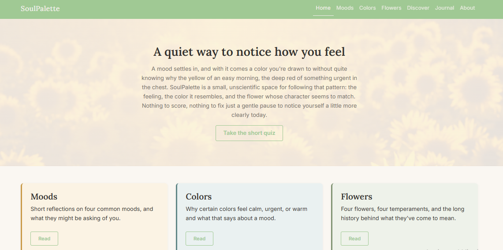
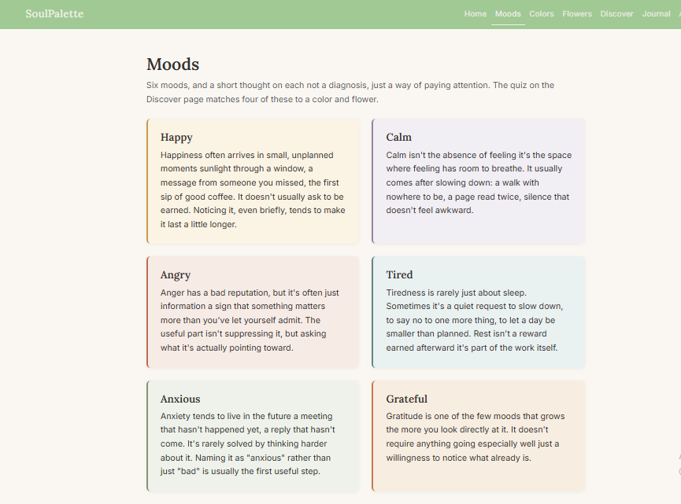
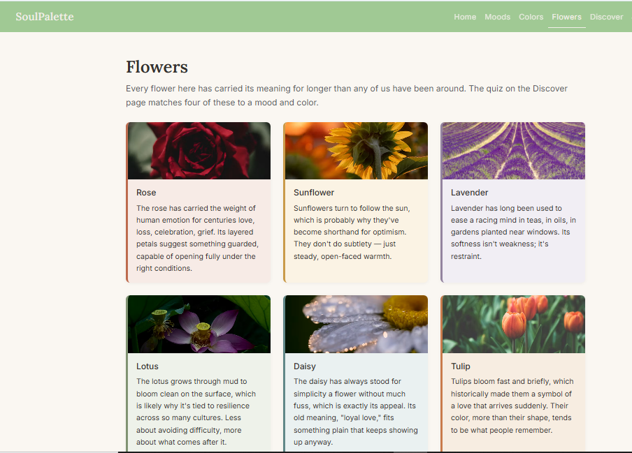
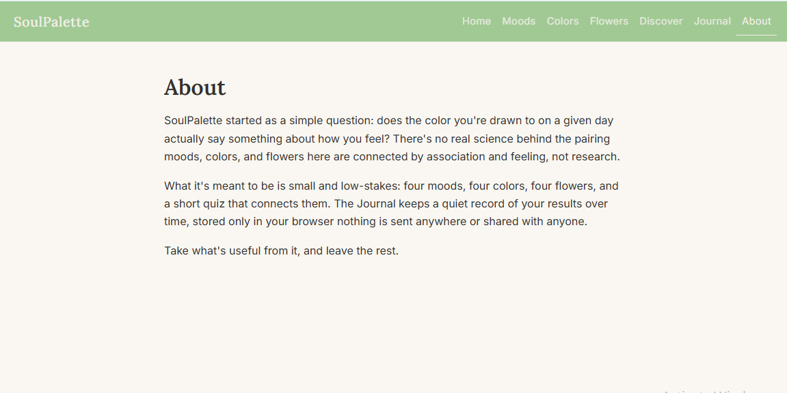

# SoulPalette

A colorful and interactive multi-page website that explores the connection between moods, colors, flowers, and personality.

## Overview

**SoulPalette** is a front-end web project built around a simple concept: emotions can be represented through colors, and colors can be expressed through flowers.

The website provides a visual experience where users can explore different moods, discover associated colors and meanings, and explore flowers that represent different personality traits.

The project focuses on clean layouts, consistent navigation, responsive design, and an engaging visual experience using modern front-end technologies.

## Features

- **Mood Exploration** — Explore different emotions and their meanings.
- **Color Personalities** — Discover the emotions and characteristics associated with different colors.
- **Flower Personalities** — Explore flowers and the traits they represent.
- **Discover** — Explore connections between moods, colors, and flowers.
- **Personal Journal** — Reflect on moods through a dedicated journal interface.
- **Responsive Design** — Designed for a consistent experience across different screen sizes.
- **Multi-page Navigation** — Separate pages connected through a consistent navigation system.

## Core Concept

```text
Mood
  ↓
Color
  ↓
Flower
  ↓
Personality
## Screenshots

### Home Page



### Moods Page



### Flowers Page



### About Page


